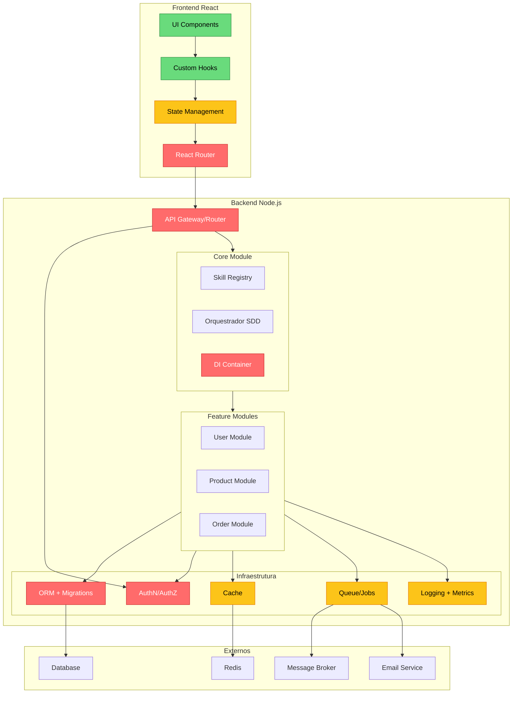
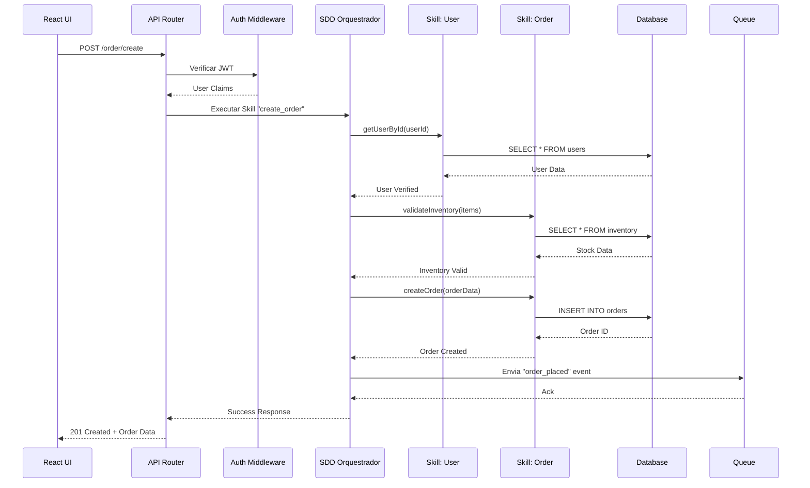

# Framework Full-Stack React + Node.js - Listas Abrangentes

## Sumário
- [Lista: Framework Modular Monolítico](#lista-framework-modular-monolítico)
- [Diagramas e Fluxos](#diagramas-e-fluxos)

---

## Lista: Framework Modular Monolítico

### 🔴 Must (Mandatório - Essencial para qualquer aplicação)

| Categoria | Funcionalidade | Detalhamento | Ambiguidades Resolvidas |
| :--- | :--- | :--- | :--- |
| **Core** | **Roteamento** | Frontend: React Router com rotas aninhadas e lazy loading. Backend: Express/Koa com middleware pipeline | *Roteamento REST vs RPC?* Ambos suportados, com preferência por RPC tipado (tRPC) para comunicação full-stack |
| | **Abstração de Banco + Migrations** | ORM/ODM (Prisma, TypeORM, Mongoose) com sistema de migrations (ex.: `prisma migrate`) | *Migrations manuais vs automáticas?* Migrations geradas automaticamente a partir de mudanças no schema, com suporte a rollback |
| | **Autenticação + Autorização** | JWT/Session com múltiplos guards (user/admin), MFA e suporte a OAuth2/Passkeys | *RBAC vs ABAC?* Ambos suportados via políticas declarativas |
| | **Validação de Dados** | Zod/Yup com validação declarativa, reutilizada entre frontend/backend | *Validação em qual camada?* Validação em ambas: cliente (UX) e servidor (segurança) |
| | **API/RPC Comunicação** | tRPC ou GraphQL com tipagem compartilhada entre frontend/backend | *REST vs GraphQL vs tRPC?* Framework agnóstico, suporta todos com preferência por tRPC |
| **Infraestrutura** | **Configuração Externalizada** | Variáveis de ambiente + config files por ambiente (dev/staging/prod) | *Config em código vs arquivo?* Config externalizada em `.env` e arquivos YAML/JSON |
| | **Logging Estruturado** | Pino/Winston com níveis (debug/info/error) e output em JSON | *Log em arquivo vs console?* Ambos, com rotação de logs e integração com ferramentas externas |
| | **Tratamento de Erros Global** | Middleware centralizado com mapeamento de erros para status HTTP | *Erros de negócio vs técnicos?* Categorização com códigos e mensagens amigáveis |
| | **Testes Automatizados** | Jest/Vitest (unitário), Supertest (integração), Playwright (E2E) | *O que testar?* Framework fornece scaffolding e mocks para todos os tipos |
| | **CLI** | Comandos: `new`, `generate`, `migrate`, `test`, `build`, `start` | *CLI minimalista vs completa?* Abrangente, com scaffolding de módulos/skills |
| | **Dev Server com Hot-Reload** | Vite para frontend, nodemon/tsx para backend com reload | *HMR vs full reload?* HMR para frontend, reload para backend |

### 🟡 Desejável (Should - Melhoram significativamente a DX e qualidade)

| Categoria | Funcionalidade | Detalhamento | Ambiguidades Resolvidas |
| :--- | :--- | :--- | :--- |
| **Infraestrutura** | **Cache** | Redis/Memcached com abstração unificada, suporte a cache de queries e sessões | *Cache local vs distribuído?* Abstração permite ambos, com fallback |
| | **Queue/Jobs** | Bull/BullMQ para tarefas assíncronas (envio de emails, processamento de imagens) | *Jobs síncronos vs assíncronos?* Framework incentiva assíncrono com workers separados |
| | **Email/SMS/Notifications** | Interface unificada para envio (Nodemailer, Twilio, SendGrid) | *Provedor específico?* Interface permite troca de provedor sem mudar código |
| | **Sessão e CSRF** | Gerenciamento de sessão (redis/banco) com tokens CSRF | *Stateless vs stateful?* Suporte a ambos, com JWT stateless ou sessão stateful |
| | **Internacionalização (i18n)** | Suporte a múltiplos idiomas com carga dinâmica de traduções | *Tradução em tempo de build vs runtime?* Runtime com cache |
| | **Painel Administrativo** | Interface admin automática (estilo Django Admin) para CRUD de models | *Admin para devs vs para usuários?* Ambos, com possibilidade de customização |
| | **Data Validation & Serialization** | Serialização automática de modelos para JSON/XML com transformers | *Transformação de dados em qual camada?* API Resource/Serializer layer |
| **Dev Experience** | **TypeScript First** | Framework 100% tipado com suporte a `ts` e `tsx` | *JS vs TS?* TS é a linguagem primária, com suporte a JS para legado |
| | **ESLint/Prettier Integrados** | Configurações padrão com possibilidade de override | *Configurações flexíveis?* Sim, com defaults "sane" para equipes |
| | **Docker Integration** | Dockerfile e docker-compose gerados automaticamente | *Docker para dev vs prod?* Ambos, com configurações específicas |

### 🟢 Possível (Can - Diferenciais competitivos)

| Categoria | Funcionalidade | Detalhamento |
| :--- | :--- | :--- |
| **Extensibilidade** | **Plugin System** | Sistema de hooks para adicionar funcionalidades sem modificar o core |
| **Evolução** | **Distributed Evolution** | Preparação para migrar módulos para microsserviços com mínimo refatoração |
| **UI Generativa** | **CRUD UI Generator** | Geração automática de interfaces CRUD a partir de modelos |
| **PWA** | **Progressive Web App** | Service Workers, manifest e offline support |
| **WebSockets** | **Real-time Communication** | Socket.io integrado para features em tempo real |
| **File Upload** | **Streaming Upload/Download** | Upload com validação, processamento e storage em S3/local |
| **API Client Generation** | **OpenAPI Client** | Geração de client HTTP tipados para consumo externo |

---

## Diagramas e Fluxos

### Diagrama: Arquitetura Monolítica Modular (SDD)

Diagrama: Arquitetura de Microsserviços (SDD)
### Fluxo: Orquestração SDD em Monólito

