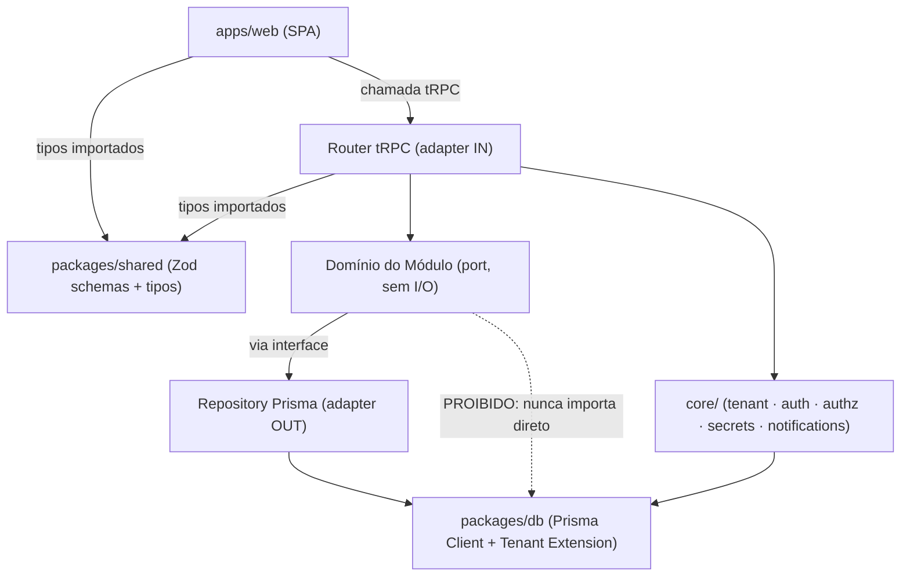
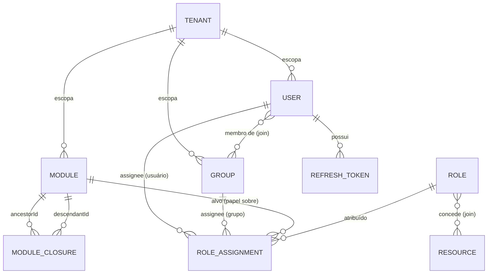

# Architecture Spine — Aether

## Design Paradigm

**Modular monolith** organizado como **Hexagonal / Ports & Adapters por Módulo**. Cada Módulo/Submódulo (a mesma entidade que é unidade de código gerada por `generate module` e nó da árvore de identidade — ver AD-6) é uma fatia vertical autocontida: lógica de domínio no centro (nenhuma dependência de Prisma/tRPC), com dois adapters de borda — tRPC router (entrada) e repository Prisma (saída). Um conjunto pequeno de módulos `core/` (tenant, auth, authz, secrets, notifications) implementa as interfaces de extensão da Superfície Pública (§9.1 do PRD) e é montado por um único módulo de composição (AD-4).

Mapeamento paradigma → diretórios: ver Estrutura Seed.

## Invariants & Rules



### AD-1 — Hexagonal por Módulo

- **Binds:** FR-3, FR-11, FR-16, todos os módulos de negócio gerados.
- **Prevents:** lógica de domínio acoplada direto a Prisma/tRPC; estrutura interna divergente entre módulos gerados por agentes/sessões diferentes; acoplamento módulo-a-módulo não mediado por porta; checagem de autorização pulada quando um módulo chama outro por um caminho que não seja o router.
- **Rule:** todo Módulo gerado por `generate module` tem exatamente 4 arquivos-adapter fixos (`router.ts`, `repository.ts`, `schema.ts`, `resources.ts`) mais um `domain/` sem import de `@prisma/client` nem de `@trpc/*`. Comunicação `domain` → `repository` só via interface (porta) definida no próprio módulo. Comunicação entre `domain/` de módulos **diferentes** é proibida — um módulo só consome outro via seu `router.ts` (chamada tRPC interna) ou via uma porta explícita exportada (`<módulo>/ports/index.ts`). Toda checagem de autorização — RBAC (AD-7) e regra de ownership/negócio — vive em `domain/`, nunca em `router.ts`, para que qualquer caminho de chamada (via router ou via porta interna) preserve a checagem.

### AD-2 — Topologia SPA, sem SSR

- **Binds:** FR-1, FR-4, NFR Instância stateless (§8.1).
- **Prevents:** acoplar o Aether à opinião de roteamento de um meta-framework; segundo servidor Node stateful no caminho crítico do MVP.
- **Rule:** `apps/web` é uma SPA Vite + React Router em modo data router (client-side), consumindo `apps/api` só via tRPC/HTTP. Nenhum SSR/RSC no MVP.

### AD-3 — Monorepo com fronteiras de pacote

- **Binds:** FR-1, FR-3, FR-15, FR-17.
- **Prevents:** duplicação/dessincronização de schema Zod entre front e back; import cruzado não controlado entre app e app; schema de domínio compartilhado (`Money`, `Address`) duplicado e divergente entre módulos; mecanismo paralelo de tipagem de client tRPC coexistindo com o padrão idiomático.
- **Rule:** pnpm workspaces com `apps/web`, `apps/api`, `packages/shared`, `packages/db`. `packages/shared` não importa de `apps/*`. `apps/web` nunca importa **valor** de `apps/api` — exceção única: `import type { AppRouter }` de `apps/api`, exclusivamente em `apps/web/src/trpc/client.ts`, para tipar o client tRPC. Schema Zod de cada Módulo vive em `packages/shared/src/schemas/<módulo>.ts` e é a única fonte — `apps/api` e `apps/web` importam a mesma definição. Tipo de domínio usado por 2+ módulos (ex.: `Money`, `Address`) vive em `packages/shared/src/schemas/common.ts`, nunca duplicado em arquivo de módulo específico; `generate module` verifica `common.ts` antes de declarar um schema já existente lá. Upload de arquivo (ex.: import CSV, FR-15) usa suporte a `FormData`/`Blob` como input de procedure tRPC — nenhum endpoint REST/multipart paralelo, mesmo para esse caso.

### AD-4 — Composição de Providers sem container de DI

- **Binds:** FR-10, FR-18, FR-26, Superfície Pública §9.1 (`AuthProvider`, `SecretsProvider`, `TokenRevocationStore`, e os pontos de extensão futuros `KeyCustodyProvider`/`WorkflowEngineProvider`), NFR §8.1 "nenhuma alegação de segurança sem reforço técnico real".
- **Prevents:** resolução implícita em runtime difícil de rastrear por um agente de IA; import direto de implementação concreta pelo código de negócio; troca de provedor exigindo tocar código consumidor; um módulo futuro introduzindo uma interface de extensão própria (ex.: `PaymentGatewayProvider`) fora do protocolo por não estar listada nos Binds; teste de unidade incapaz de mockar um Provider sem afetar todo o processo de teste.
- **Rule:** um único arquivo `apps/api/src/core/providers.ts` instancia cada Provider a partir de config/env e exporta a instância; nenhum outro arquivo importa a classe concreta (`Argon2Auth`, `EnvSecrets`, `PrismaTokenRevocationStore` etc.) — só o tipo da interface. O protocolo vale para **qualquer** interface de extensão que qualquer módulo introduza, não só as listadas em Binds. A instância chega a `router.ts`/`domain/` exclusivamente via `ctx` do tRPC, injetado uma vez em `createContext` a partir de `providers.ts` — nenhum arquivo fora de `providers.ts`/`createContext` importa a instância diretamente (permite mock por override de contexto em teste, FR-21). A chave de assinatura JWT (`jose`) segue o mesmo caminho do pepper (FR-8): lida via `SecretsProvider`, nunca hardcoded ou gerada ad-hoc por módulo. Sem container reflexivo (tsyringe/Inversify).

### AD-5 — Isolamento de tenant via Prisma Client Extension

- **Binds:** FR-2, FR-11, NFR Isolamento de tenant (§8.1).
- **Prevents:** query mal escrita num Módulo gerado vazando dado de outro Tenant; amarração a feature específica de um banco (RLS, `ltree`); raw SQL contornando o filtro de tenant; código de módulo instanciando um `PrismaClient` não-escopado "porque a Rule não proibiu explicitamente"; fluxo pré-autenticação sem forma definida de saber qual Tenant consultar.
- **Rule:** todo acesso a modelo escopado por Tenant passa por um Prisma Client estendido (`packages/db`) construído por request a partir do `tenantId` do contexto tRPC autenticado — nunca há um `PrismaClient` global usado diretamente por um `repository.ts`. A extensão injeta/valida `tenant_id` automaticamente; não depende de recurso específico de banco (mantém Postgres/MySQL/MS-SQL, FR-11) — o driver adapter (`@prisma/adapter-pg`/`-mysql`/`-mssql`, mecânica obrigatória desde o Prisma 7) é instanciado uma vez por banco alvo dentro da mesma extensão. `$queryRaw`/`$executeRaw`/`$queryRawUnsafe` são **proibidos** em qualquer `repository.ts` de módulo de negócio — agregação que exigir SQL bruto passa por uma view/função Postgres já filtrada por tenant, nunca raw query ad-hoc no código do módulo. Os únicos usos legítimos de `PrismaClient` não-estendido são scripts fora do runtime de request (seed/migration, execução manual) e `core/admin` sob checagem explícita de super-admin. Fluxos pré-autenticação (login, redefinição de senha) recebem `tenantId`/`tenantSlug` como input explícito da procedure; MVP não resolve tenant por subdomínio/host — uma instalação single-tenant usa o único Tenant seedado como default.

### AD-6 — Módulo de código = nó da árvore de identidade

- **Binds:** FR-3, FR-11, Glossário do PRD. Fixa o invariante do **modelo de dados** do projeto gerado — não a arquitetura interna do próprio CLI `aether-admin` (essa fica em Deferred).
- **Prevents:** código gerado sem nó correspondente na árvore, ou nó sem módulo — dessincronia entre os dois conceitos que o PRD já trata como um só termo; dois protocolos incompatíveis de escrita no Closure Table (um exigindo DB de dev ativo em generate-time, outro via migration que pode nunca rodar); contagem de descendentes off-by-one entre módulos gerados em sessões diferentes; admin criando um "nó organizacional" sem código correspondente, reabrindo exatamente a dessincronia que esta AD fecha.
- **Rule:** `generate module <nome>` escreve os arquivos de código (AD-1) **e** aplica, como parte do mesmo comando, a migration Prisma que insere a linha em `Module` e as linhas correspondentes em `ModuleClosure` — a CLI roda a migration antes de retornar sucesso. Nenhum outro caminho (API em runtime, seed manual, tela de admin) cria linha em `Module`. Toda criação de módulo insere uma linha self-referencial (`ancestorId=id, descendantId=id, depth=0`) mais uma linha por ancestral do pai (`depth` herdado + 1) — `ModuleClosure` tem coluna `depth` obrigatória. `ModuleClosure` é **append-only no MVP**: reparent/mover um Módulo depois de criado está fora do escopo (mesmo status que a árvore drag-and-drop, ver Deferred), então nenhum código de produto faz `DELETE` nessa tabela. A administração (FR-14) edita metadados de um Módulo existente e gerencia associações/atribuições sobre ele, mas nunca cria um Módulo novo — criação é exclusiva de `generate module`. Todo `Module` tem o diretório `apps/api/src/modules/<slug>/` correspondente; não existe "nó sem módulo de código".

### AD-7 — Enforcement de permissão via middleware central (default-deny)

- **Binds:** FR-3, FR-11, FR-12, FR-27.
- **Prevents:** handler esquecer de checar autorização; verificação divergente entre módulos gerados em momentos/sessões diferentes; acesso liberado por omissão.
- **Rule:** todo procedure tRPC gerado é criado com `.use(requireResource('<resource-id>'))`, um middleware único e central (`core/authz`). `resource-id` é sempre `<module-slug>.<ação>` (ex.: `orders.create`), gerado automaticamente por `generate module` a partir do nome do módulo e da operação — nunca uma string livre escolhida ad-hoc por sessão. `RESOURCE.name` tem constraint de unicidade global; `generate module` falha explicitamente (nunca reaproveita silenciosamente uma linha existente) se colidir. O middleware resolve o usuário autenticado, sobe a `ModuleClosure` a partir do Módulo alvo em uma única query (sem N+1), verifica cobertura por Papel concedido (herança aditiva simples aos descendentes, sem bloqueio/override — FR-12, Glossário [ADOPTED]) e nega por padrão. A única exceção é uma procedure marcada explicitamente pública (flag/decorator visível no código gerado) — nunca ausência silenciosa de checagem.

### AD-8 — Orçamento de latência do enforcement, sem cache

- **Binds:** FR-11, FR-27, NFR §8.1, PRD §11 (questão aberta #1).
- **Prevents:** cache in-process por réplica quebrando revogação imediata (FR-9); introdução de Redis fora do escopo já fechado; meta de performance ficar indefinida.
- **Rule:** a meta p95 < 10ms (escala de dev/pequena equipe) cobre o middleware `requireResource` **inteiro** — ancestralidade + resolução de Papel + cobertura de Recurso, ponta a ponta — não só a subconsulta de ancestralidade. Índices obrigatórios cobrem toda tabela tocada pelo caminho crítico: `ModuleClosure(ancestorId, descendantId)`, `RoleAssignment(assigneeId, targetModuleId)`, e o join Papel↔Recurso. Nenhuma camada de cache (in-process ou externa) na frente dessa consulta no MVP.

### AD-9 — Sem alvo de deploy de produção no MVP

- **Binds:** FR-6, FR-23, PRD §6.2.
- **Prevents:** arquitetura amarrada a um provider de infra antes de necessário; escopo além do que o PRD já fechou.
- **Rule:** o envelope operacional do MVP cobre só ambiente de dev local (`aether-admin dev` + Docker Compose de dev) e configuração externalizada por ambiente (FR-6). Nenhum Dockerfile de produção, pipeline de CI/CD ou provider de nuvem é parte desta spine — ver Deferred.

### AD-10 — Rate limiting Postgres-backed, tabela própria

- **Binds:** FR-28.
- **Prevents:** introdução de Redis fora do escopo já fechado; contador em memória por réplica que não pega ataque distribuído entre instâncias; tabela de rate-limit reaproveitando colunas/semântica da tabela de revogação de refresh token (FR-9 fala em "mesmo banco de dados", não "mesma tabela" — as duas features não devem disputar dono de uma única tabela).
- **Rule:** um único plugin Fastify em `core/auth` aplica rate limit por identificador (email/IP) contra uma tabela Postgres **própria** (`RateLimitHit(identifier, windowStart, count)`), no mesmo banco de dados usado pelo `TokenRevocationStore` (FR-9) mas fisicamente separada dele — nunca contador in-process, nunca coluna reaproveitada da tabela de revogação. Login e redefinição de senha usam o mesmo plugin/tabela, nunca implementações paralelas.

## Consistency Conventions

| Concern | Convention |
| --- | --- |
| Naming (interfaces de extensão) | Sem prefixo de projeto — `AuthProvider`, não `AetherAuthProvider` [ADOPTED de `docs/aether-tecton-compatibility.md`, convenção compartilhada com o Tecton]. |
| Naming (arquivos / tipos / funções) | Arquivos: kebab-case. Tipos/interfaces: PascalCase. Funções/variáveis: camelCase. |
| IDs de entidade | UUID v7 (ordenável por tempo de criação; `@default(uuid(7))` nativo do Prisma desde 5.18 — funciona em Postgres/MySQL/MS-SQL sem extensão, mantendo FR-11). |
| Colunas físicas (Postgres) | Sempre `snake_case` via `@map`/`@@map` no `schema.prisma`; campos TS/Prisma continuam `camelCase` — evita quebrar SQL manual/relatório que assume snake_case. |
| Erros | RFC 9457 Problem Details + `invalid-params` para validação (FR-25); sucesso sem envelope; correlação via header `traceparent` (W3C Trace Context, FR-24) [ADOPTED do PRD, convenção compartilhada com o Tecton]. `invalid-params[].name` é sempre JSON Pointer relativo (RFC 6901) ao input da procedure (ex.: `/items/2/price`) — nunca dot-notation "flattened". |
| Autenticação | Access token JWT em memória no cliente; refresh token em cookie `httpOnly`+`SameSite`; nunca em `localStorage` (FR-7) [ADOPTED do PRD]. Toda requisição verifica a assinatura do JWT via `AuthProvider` (core/auth) — nenhum caminho de código confia implicitamente por "estar dentro do processo", nem mesmo temporariamente (Zero Trust interno, NIST SP 800-207, §8.1 — decisão compartilhada com o Tecton). Estado do access token e lógica de refresh vivem exclusivamente no client tRPC (link único em `apps/web/src/trpc/client.ts`); qualquer chamada HTTP fora desse client (ex.: download binário) importa o token do mesmo módulo singleton, nunca duplica o estado. |
| Config | Variáveis de ambiente + arquivo por ambiente; nunca hardcoded em arquivo versionado (FR-6) [ADOPTED do PRD]. No MVP só `.env.development`/`.env.dev.local` são de fato scaffolded (AD-9) — `staging`/`produção` são nomes reservados, não gerados agora. |
| Validação | Todo input de procedure tRPC validado por schema Zod de `packages/shared`, reaproveitado em formulário do frontend sem duplicar (FR-17) [ADOPTED do PRD]. |
| Data fetching (frontend) | `loader` de rota (React Router data router, AD-2) chamando o client tRPC diretamente; sem TanStack Query no MVP — evita duas fontes de cache/tratamento de erro coexistindo entre módulos. |
| Testes | Arquivo de teste co-localizado (`router.test.ts` ao lado de `router.ts`), gerado automaticamente por `generate` (FR-21). |
| Logging | JSON estruturado via Pino, nível configurável por ambiente, 1 linha por requisição com `traceparent` (FR-24) [ADOPTED de `aether-mvp-vision-decisoes.md`]. |
| Hashing de senha | Argon2id via biblioteca `argon2`, parâmetros OWASP baseline: m=19456 KiB, t=2, p=1 (FR-8). |

## Stack

| Name | Version |
| --- | --- |
| Node.js | 24 (Active LTS) |
| TypeScript | 5.9 (última da série 5.x — TS 7.0/compilador Go, GA em 2026-07-08, fica para quando o ecossistema — typescript-eslint em especial — confirmar suporte) |
| pnpm | 11.x (workspaces) |
| Fastify | 5.x |
| tRPC (`@trpc/server`, `@trpc/client`) | 11.13.x |
| Prisma | 7.x |
| Zod | 4.4.x |
| React | 19.x |
| React Router | ^7 (modo data router/client-side — v8 disponível, adiado pelo mesmo racional do TS 7) |
| Vite | 8.x |
| Vitest | alinhado ao Vite 8 (4.x) |
| ESLint | 10.x (flat config, sucessor do 9.x — 9.x é EOL desde 2026-08-06) + typescript-eslint |
| Prettier | 3.x |
| argon2 | binding nativo, Argon2id |
| jose | assinatura/verificação de JWT (HS256 no MVP — ver nota de reconciliação abaixo) |
| Pino | logging estruturado |

> **Nota de reconciliação (Story 2.1, 2026-08-31):** esta linha originalmente fixava EdDSA. Na implementação de login (Story 2.1), a escolha foi revertida pra HS256: EdDSA exigiria gerar/gerenciar um keypair PEM assimétrico via `SecretsProvider` — complexidade de key management sem nenhum requisito do projeto que a justifique ainda (não há, no MVP, nenhum serviço externo que precise verificar o token sem ter acesso ao segredo de assinatura — o único cenário em que assimetria compra algo real). HS256 com chave simétrica de alta entropia, lida via `SecretsProvider` do mesmo jeito que o pepper do Argon2id (FR-8), atende NFR-4 ("sem alegação de segurança sem reforço técnico real") com uma superfície de implementação bem menor. EdDSA fica candidato de upgrade futuro se/quando um motivo real aparecer (ex.: um verificador externo que não deve ter o segredo de assinatura).

## Structural Seed

```text
aether-project/                  # gerado por `aether-admin new`
  apps/
    web/                         # SPA: React 19 + Vite + React Router (data router)
      src/
        routes/                  # árvore de rotas
        trpc/                    # client tRPC tipado
    api/
      src/
        core/
          tenant/                # resolvedor consciente de tenant (AD-5)
          auth/                  # AuthProvider — porta + adapter local (Argon2id, jose)
          authz/                 # middleware de enforcement (AD-7/AD-8)
          secrets/               # SecretsProvider — porta + adapter env
          notifications/         # interface de email — porta + adapter (dev: Mailpit)
          providers.ts           # composição — único ponto que instancia adapters (AD-4)
        modules/
          system/                # módulo default (nasce com `new`, FR-3)
            domain/               # lógica de negócio, sem import de prisma/trpc (AD-1)
            router.ts             # adapter IN — tRPC, protegido por AD-7
            repository.ts         # adapter OUT — Prisma via tenant extension (AD-5)
            schema.ts             # reexporta de packages/shared
            resources.ts          # Recursos (permissões nomeadas) do módulo
        root-router.ts           # monta o router de cada módulo (FR-1)
        server.ts                # bootstrap Fastify
  packages/
    shared/
      src/schemas/<modulo>.ts    # única fonte de schema Zod por módulo (AD-3)
    db/
      schema.prisma              # Tenant, User, Group, Role, Module, ModuleClosure, ...
      extensions/tenant.ts       # Prisma Client Extension (AD-5)
  docker/
    docker-compose.dev.yml       # banco escolhido no setup (FR-2) + Mailpit (FR-20)
    Dockerfile.dev               # dev only — sem hardening (FR-23)
```



*Nota: `RESOURCE.kind` distingue `NAMED_PERMISSION` (implementado no MVP) de `BUSINESS_OBJECT` (contrato `ResourceType` previsto, sem ferramenta de registro genérica no MVP — FR-13). `RESOURCE.name` é único globalmente e segue o padrão `<module-slug>.<ação>` (AD-7). `MODULE_CLOSURE` tem `depth` obrigatório (0 = linha self-referencial) e é append-only no MVP — sem reparent (AD-6). `RATE_LIMIT_HIT(identifier, windowStart, count)` (AD-10) é uma tabela de infraestrutura própria, fora do escopo desta ERD de identidade.*

## Capability → Architecture Map

| Capability / Area | Lives in | Governed by |
| --- | --- | --- |
| FR-1, FR-4, FR-6 (CLI, scaffolding, dev server, config) | raiz do projeto gerado, `apps/*` | AD-2, AD-3, AD-9 |
| FR-2, FR-11, §8.1 Isolamento de tenant | `packages/db/extensions/tenant.ts` | AD-5 |
| FR-3 (`generate module`) | `apps/api/src/modules/<nome>/`, `packages/shared/src/schemas/<nome>.ts` | AD-1, AD-3, AD-6 |
| FR-5 (migrations) | `packages/db/schema.prisma` | Stack (Prisma) |
| FR-7, FR-8, FR-9, FR-10, FR-26 (auth/segredos) | `apps/api/src/core/{auth,secrets}` | AD-4, Consistency Conventions |
| FR-28 (rate limiting) | `apps/api/src/core/auth` (plugin Fastify) | AD-10 |
| FR-11, FR-12, FR-13, FR-14 (árvore de identidade + admin) | `packages/db/schema.prisma` (Module/ModuleClosure/User/Group/Role/Resource), módulo `core` de admin | AD-6, AD-7, AD-8, ERD |
| FR-15 (import em lote de Usuários, upload CSV) | módulo `core` de admin, transporte via `apps/api` | AD-3 (upload via FormData/Blob), AD-6, ERD |
| FR-16, FR-17 (tRPC + Zod) | `apps/api/src/root-router.ts`, `packages/shared` | AD-1, AD-3 |
| FR-18, FR-19, FR-20 (notificações) | `apps/api/src/core/notifications` | AD-4 |
| FR-21, FR-22 (testes/lint) | scaffolding gerado por `generate` | Stack |
| FR-23 (Docker dev) | `docker/` | AD-9 |
| FR-24, FR-25 (logging/erros) | `apps/api/src/server.ts` (middleware global) | Consistency Conventions |
| FR-27 (enforcement) | `apps/api/src/core/authz` | AD-7, AD-8 |

## Deferred

- **Arquitetura interna do próprio `aether-admin` CLI** (o gerador) — esta spine governa o projeto gerado, não a ferramenta que o gera. Fica para uma spine própria se/quando o CLI crescer o suficiente para precisar de invariantes formais.
- **Alvo de deploy de produção, Dockerfile hardened, pipeline CI/CD** (AD-9) — Fast-follow explícito do PRD (§6.2); revisitar quando o MVP tiver o primeiro projeto real em produção.
- **Cache (Redis), filas assíncronas** — Fast-follow explícito do PRD; revisitar se a meta de latência do AD-8 deixar de se sustentar em escala real.
- **Autenticação plugável (Keycloak, OpenBAO)** — Roadmap; a porta `AuthProvider` (AD-4) já existe para isso, implementação fica para quando houver demanda real.
- **Isolamento de tenant por banco dedicado** — Roadmap; a extensão de tenant (AD-5) já é o ponto de troca, sem reforma prevista.
- **`TokenRevocationStore` Redis-backed** — Roadmap opcional da mesma interface; MVP é Postgres/Prisma-backed (FR-9).
- **Árvore visual com drag-and-drop** — Roadmap; o modelo de dados (ERD) já está preparado, a UI de FR-14 é deliberadamente não-drag-and-drop no MVP.
- **Reparent/mover um Módulo após criado** — mesmo status que o item acima (`ModuleClosure` é append-only no MVP, AD-6); qualquer forma de mover um nó na árvore, drag-and-drop ou não, fica para quando essa funcionalidade for desenhada de verdade.
- **Convenção de componentes/estilo (UI kit, Tailwind vs. CSS Modules etc.) para as telas de admin (FR-14)** — sem artefato de UX (`bmad-ux`) alimentando esta spine ainda; não travar isso sem input de design. Revisitar quando houver uma sessão de UX para o Aether.
- **Bloqueio/override de herança por nó** — extensão futura explícita sobre o modelo aditivo (FR-12); decisão de modelo já fechada com o Tecton, não revisitar sem nova crítica formal.
- **`KeyCustodyProvider`, `WorkflowEngineProvider`** — interfaces previstas na Superfície Pública (§9.1), sem implementação nem wiring concreto no MVP; entram em `providers.ts` (AD-4) quando implementados.
- **Tipo de Recurso `BUSINESS_OBJECT` (Objeto de Negócio Real)** — contrato de tipo já no ERD (`RESOURCE.kind`), sem ferramenta de registro genérica (FR-13).
- **`aether-admin generate` além do tipo `module`** — PRD §11 (questão aberta #2) não enumera outros tipos (ex.: página, componente); esta spine não antecipa a forma desses geradores.
- **Internacionalização, WebSockets, upload em streaming, PWA, geração de client OpenAPI, sistema de plugins** — Fast-follow/Someday do PRD, sem impacto na spine atual.
