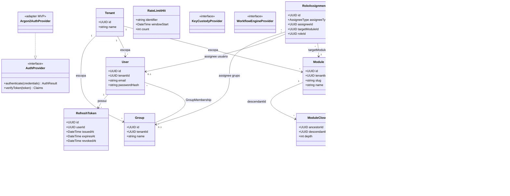
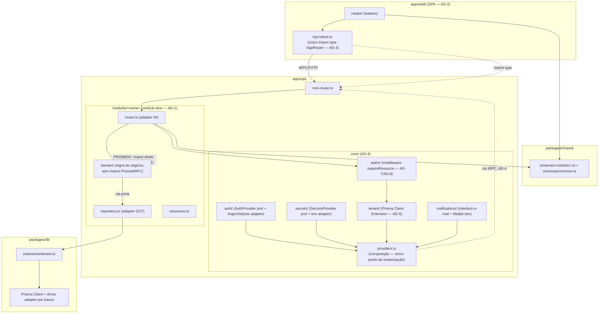
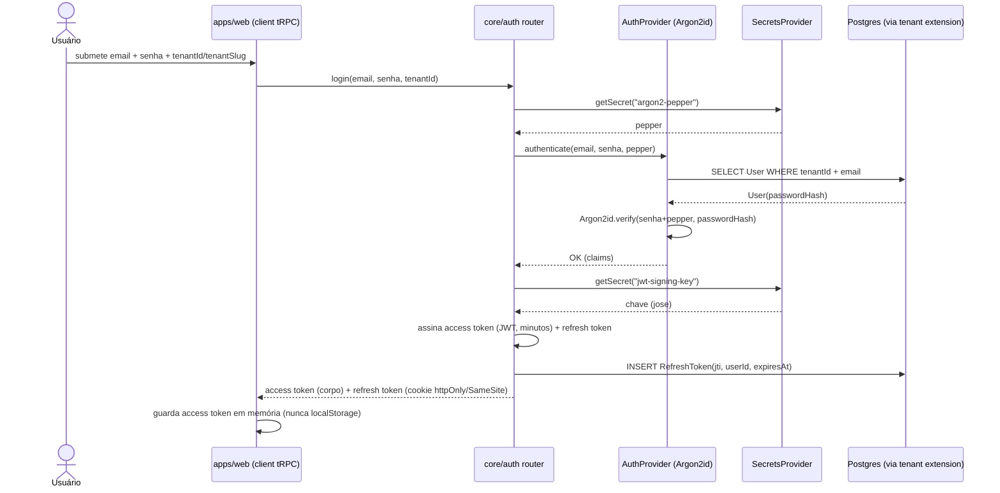
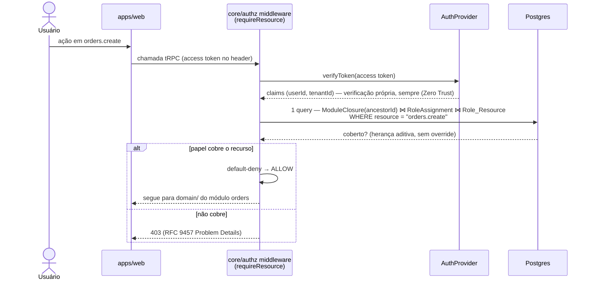
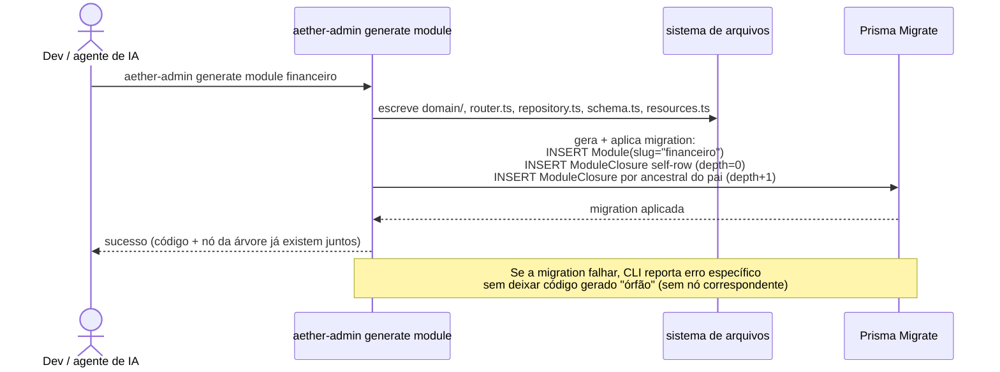
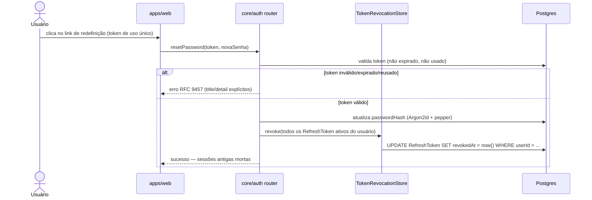
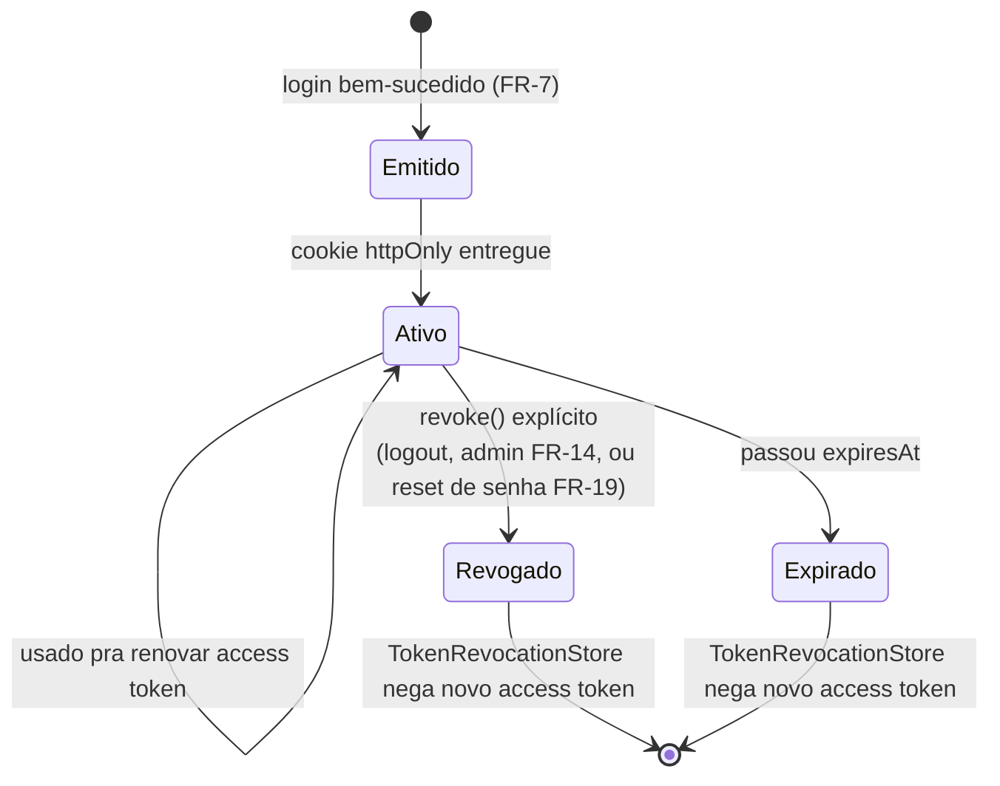

# Aether — Diagramas UML

Companion visual da [Architecture Spine](../_bmad-output/planning-artifacts/architecture/architecture-Aether-2026-08-14/ARCHITECTURE-SPINE.md) (AD-1 a AD-10). Não introduz nenhuma decisão nova — cada diagrama aqui é uma projeção UML das ADs já fechadas, pra servir de referência visual antes de destilar o SPEC via `bmad-spec`. Se algum diagrama divergir da spine no futuro, a spine é a autoridade — atualizar aqui para igualar, não o contrário.

## 1. Diagrama de Classes — Domínio de Identidade + Interfaces de Extensão

Modelo de dados (ERD da spine, em notação UML) + as portas Hexagonais (AD-4) com seus adapters MVP.

**Notas de leitura** (não repetir na spine, só aqui como legenda):
- `ModuleClosure` tem as duas FKs pra `Module` (AD-6) — toda criação insere a linha self-referencial (`depth=0`) mais uma por ancestral do pai.
- `Resource.name` é único globalmente, formato `<module-slug>.<ação>` (AD-7) — por isso não há FK direta `Resource → Module` no ERD original: o namespace já embute a origem.
- `RateLimitHit` (AD-10) é infraestrutura de `core/auth`, deliberadamente sem relação com `RefreshToken` — tabelas fisicamente separadas mesmo banco.
- `KeyCustodyProvider`/`WorkflowEngineProvider` aparecem tracejados por convenção só pra mostrar onde entram na composição (AD-4) quando implementados — sem adapter MVP.

## 2. Diagrama de Componentes

Fronteiras de pacote (AD-3) e a fatia Hexagonal por módulo (AD-1), com as interfaces expostas/consumidas entre `core/` e os módulos de negócio.

## 3. Diagramas de Sequência

### 3.1 Login + emissão de token (FR-7, FR-8, Zero Trust §8.1)

### 3.2 Enforcement de permissão numa chamada protegida (FR-27, AD-7, AD-8)

### 3.3 `generate module` — código + nó da árvore na mesma operação (AD-6)

### 3.4 Redefinição de senha por link (FR-19) invalidando sessões (FR-9)

## 4. Diagrama de Estados — Refresh Token (FR-7, FR-9)

## Rastreabilidade

| Diagrama | ADs / FRs cobertos |
| --- | --- |
| Classes | AD-4, AD-5, AD-6, AD-7, AD-10 · FR-7, FR-8, FR-9, FR-11, FR-12, FR-13, FR-26, FR-28 |
| Componentes | AD-1, AD-2, AD-3, AD-4 · FR-1, FR-3, FR-4, FR-16, FR-17 |
| Sequência 3.1 (login) | AD-4 · FR-7, FR-8, §8.1 Zero Trust |
| Sequência 3.2 (enforcement) | AD-7, AD-8 · FR-27 |
| Sequência 3.3 (generate module) | AD-6 · FR-3 |
| Sequência 3.4 (reset senha) | AD-5 · FR-9, FR-19 |
| Estados (refresh token) | FR-7, FR-9 |
